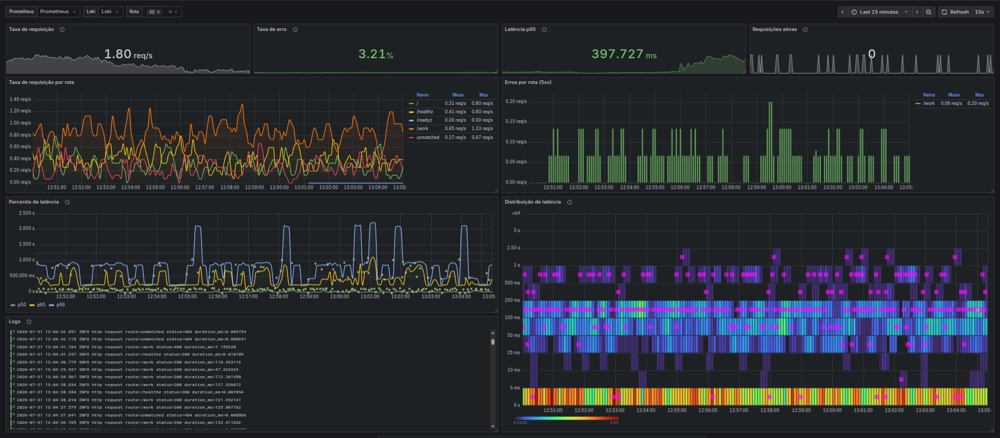
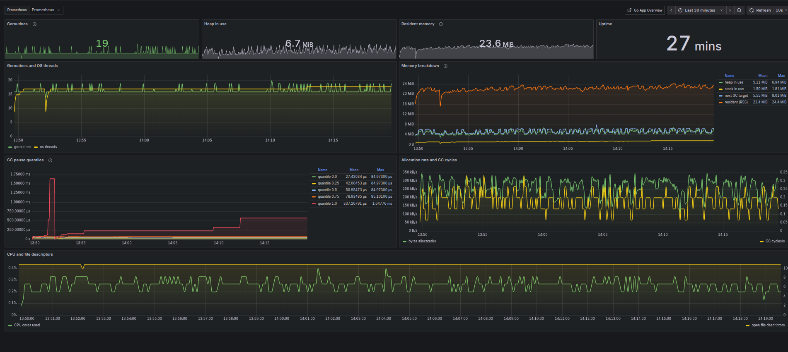
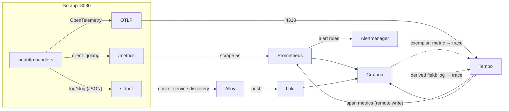

# Go Observability Starter

[](https://github.com/lvcas-dotcom/go-observability-starter/actions/workflows/ci.yml)
[](LICENSE)
[](app/go.mod)

**A complete observability stack for a Go service — metrics, logs and traces, wired to each other — that boots populated with one command.**

[Português](README.pt-BR.md)



---

## Why another one

Most observability starters hand you empty infrastructure. You wire up the
datasource, build a dashboard from scratch, then run `curl` in a loop just to
see a line move. Half of them still ship components that upstream has retired.

This one is different in three ways:

**It boots with data in it.** The sample app generates its own traffic, with
realistic latency, a slow path and a failure rate. Every panel is populated
within seconds of `docker compose up` — no manual `curl`, no empty graphs.

**The three pillars actually link to each other.** A latency spike on a graph
carries an exemplar you click to open the exact trace behind it. That trace
links to the log lines it produced. Those log lines link back to the trace.
That correlation is the part most tutorials skip, and it is the part that
matters when something is actually broken.

**Nothing here is deprecated.** Alloy instead of the retired Promtail. Loki
with TSDB and schema v13, not the deprecated boltdb-shipper on v11. Prometheus
3 with native histograms and exemplar storage enabled. CI boots the whole stack
on every commit and asserts each component genuinely works.

---

## Quick start

```bash
git clone https://github.com/lvcas-dotcom/go-observability-starter.git
cd go-observability-starter
docker compose up --build
```

Then open **<http://localhost:3000>** — it lands directly on the dashboard,
already populated. No login, no datasource setup, no dashboard import.

| Service | URL | What it is |
|---|---|---|
| **Grafana** | <http://localhost:3000> | Dashboards, opens on the overview |
| Sample app | <http://localhost:8080> | The instrumented Go service |
| Raw metrics | <http://localhost:8080/metrics> | What Prometheus scrapes |
| Prometheus | <http://localhost:9090> | Metrics, recording rules, alert rules |
| Alertmanager | <http://localhost:9093> | Firing alerts |
| Loki | <http://localhost:3100> | Logs API |
| Tempo | <http://localhost:3200> | Traces API |

Requires Docker with the Compose v2 plugin. `make up` does the same thing and
prints the links.

---

## The 60-second tour

This is the part worth actually doing — it is what the repo exists to show.

**1. Metric → trace.** On the latency percentiles panel, find one of the
little dots on the p95 line. Those are exemplars. Click one and Grafana opens
the exact trace that produced that latency sample, span by span. You will land
on a `query-database` span that took 800ms because the sample app deliberately
puts 10% of requests on a slow path.

**2. Trace → logs.** Inside that trace, click *Logs for this span*. You get the
log lines that request emitted — matched by trace ID, not by guessing at
timestamps.

**3. Log → trace.** Go the other way: expand any line in the *Logs* panel and
click its **TraceID** link. Straight back into Tempo.

**4. Service graph.** Explore → Tempo → *Service Graph*. Tempo derives it from
span metrics and remote-writes them into Prometheus. No extra instrumentation.

**5. Break it on purpose.**

```bash
docker compose stop app        # AppDown fires in ~30s
docker compose start app
```

Watch it at <http://localhost:9090/alerts> and <http://localhost:9093>.

There is a second dashboard for the Go runtime — goroutines, heap, GC pauses
and process resources, all of it free from `client_golang`:



---

## How it fits together



| Component | Version | Role |
|---|---|---|
| [Prometheus](https://prometheus.io) | 3.6 | Metrics, recording rules, alert rules, exemplar storage |
| [Loki](https://grafana.com/oss/loki/) | 3.5 | Logs, TSDB + schema v13, structured metadata |
| [Tempo](https://grafana.com/oss/tempo/) | 2.8 | Traces, span metrics, service graph |
| [Alloy](https://grafana.com/docs/alloy/) | 1.10 | Log collection — replaces the retired Promtail |
| [Alertmanager](https://prometheus.io/docs/alerting/latest/alertmanager/) | 0.28 | Alert routing, grouping, inhibition |
| [Grafana](https://grafana.com/oss/grafana/) | 12.1 | Dashboards and datasource correlation |
| Sample Go app | Go 1.26 | `client_golang` + `log/slog` + OpenTelemetry |

---

## Patterns worth stealing

The sample app is small on purpose, but every piece of it is there for a
reason. These are the bits worth copying into a real service:

**Trace-correlated logs.** A custom `slog.Handler` stamps `trace_id` and
`span_id` onto every record from the request context
([`logging.go`](app/logging.go)). This one detail is what makes every
log↔trace link in Grafana work.

**Exemplars on the histogram.** The metrics middleware attaches the active
trace ID to each observation ([`middleware.go`](app/middleware.go)), and
`/metrics` is served with OpenMetrics enabled so they actually reach
Prometheus. Without the second half, the first half is silently discarded.

**Route labels, never raw paths.** The label comes from the route pattern, not
`r.URL.Path`. Putting a raw path in a Prometheus label is the fastest way to
melt your TSDB the moment real traffic with IDs in the URL shows up. There is
a test that fails if this regresses.

**A response wrapper that does not break streaming.** Naively wrapping
`http.ResponseWriter` silently kills SSE and WebSockets, because the wrapper
stops satisfying `http.Flusher` and `http.Hijacker`.
[`middleware.go`](app/middleware.go) implements `Unwrap` plus explicit
`Flush`/`Hijack`/`ReadFrom`.

**Panic recovery inside the instrumentation, not outside it.** The obvious
placement — wrapping the whole mux in a recovery middleware — means a panic
unwinds straight past the code that records metrics. The endpoint that breaks
most is then the one that *disappears* from your graphs instead of spiking.
[`server.go`](app/server.go) puts recovery inside, and the recording runs in a
`defer`. There is a test that fails if the order is flipped back.

**Liveness split from readiness.** `/healthz` says the process is alive;
`/readyz` says it should receive traffic. Shutdown flips readiness first, then
drains. Conflating the two is how a restart loop starts during an outage.

**Graceful shutdown that flushes telemetry.** The whole lifecycle lives in
`run() error` rather than `main()`, so deferred cleanup actually executes and
the last batch of spans is not dropped — precisely the traces you most want
after a crash.

**Real HTTP server timeouts.** `http.ListenAndServe` leaves every timeout at
zero, meaning no timeout at all, which is trivially Slowloris-able. See
[`server.go`](app/server.go).

**Recording rules as a single source of truth.** "Error rate" is defined once
in [`prometheus/rules/`](prometheus/rules/), so a panel and the alert that
pages you can never disagree about what it means.

---

## Using it with your own app

The stack does not care that the sample app is the one being watched.

1. **Expose `/metrics`** with `promhttp.HandlerFor(reg, promhttp.HandlerOpts{EnableOpenMetrics: true})`.
   OpenMetrics is required for exemplars.
2. **Point Prometheus at it** — edit the `go-app` job in
   [`prometheus/prometheus.yml`](prometheus/prometheus.yml).
3. **Logs need no changes** if you already log JSON to stdout. Alloy discovers
   every container through the Docker socket. Match the field names in
   [`alloy/config.alloy`](alloy/config.alloy) to get `level` and `trace_id`
   parsed out.
4. **Send traces** to `tempo:4318` (OTLP/HTTP) or `tempo:4317` (gRPC). The
   standard `OTEL_EXPORTER_OTLP_ENDPOINT` variable is all most SDKs need.
5. **Adjust the dashboards** if your metric names differ. The panels use a
   `$route` template variable, so a different label name is a find-and-replace.

To run the stack against real traffic instead of the generator:

```bash
DEMO_TRAFFIC=false docker compose up --build
```

---

## Configuration

Copy [`.env.example`](.env.example) to `.env` — Compose reads it automatically.

| Variable | Default | What it does |
|---|---|---|
| `DEMO_TRAFFIC` | `true` | Synthetic traffic generator |
| `LOG_LEVEL` | `info` | `debug`, `info`, `warn`, `error` |
| `TRACE_SAMPLE_RATE` | `1.0` | Fraction of requests traced |
| `VERSION` | `dev` | Image tag and `app_build_info` |
| `PROMETHEUS_RETENTION` | `24h` | How long metrics stay on disk |
| `SHUTDOWN_TIMEOUT` | `10s` | Grace period for in-flight requests |
| `APP_PORT`, `GRAFANA_PORT`, … | see `.env.example` | Host port mapping |

Invalid values fail the boot loudly instead of silently falling back to a
default nobody asked for.

---

## Alerting

Rules live in [`prometheus/rules/app-rules.yml`](prometheus/rules/app-rules.yml)
— five recording rules and six alerts:

| Alert | Fires when |
|---|---|
| `AppDown` | The app has not been scraped for 30s |
| `HighErrorRate` | 5xx ratio above 15% for 2m |
| `HighLatencyP95` | p95 above 1s for 2m |
| `NoTrafficReceived` | Essentially no requests for 5m — silence is not health |
| `GoroutineLeakSuspected` | Goroutines above 500 for 10m |
| `ObservabilityComponentDown` | Any stack component is down for 1m |

The default Alertmanager receiver deliberately goes nowhere, so the stack has
no external dependency to boot. Alerts are still fully visible at
<http://localhost:9093>. To get notified for real, uncomment the Slack or
webhook block in [`alertmanager/alertmanager.yml`](alertmanager/alertmanager.yml)
and put the URL in `.env` rather than committing it.

---

## Layout

```
.
├── app/                       # instrumented Go service
│   ├── main.go                #   lifecycle, signals, graceful shutdown
│   ├── server.go              #   routing, middleware chain, HTTP timeouts
│   ├── middleware.go          #   RED metrics, exemplars, access log, recovery
│   ├── handlers.go            #   endpoints and simulated work
│   ├── metrics.go             #   private registry, native histograms
│   ├── tracing.go             #   OTel setup, OTLP exporter, sampling
│   ├── logging.go             #   slog handler with trace correlation
│   ├── traffic.go             #   synthetic traffic generator
│   ├── config.go              #   env config with validation
│   └── *_test.go              #   39 tests, race-clean
├── prometheus/
│   ├── prometheus.yml         # scrape config, self-monitoring
│   └── rules/app-rules.yml    # recording + alert rules
├── alertmanager/
├── loki/                      # TSDB, schema v13, structured metadata
├── tempo/                     # OTLP receivers, span metrics generator
├── alloy/config.alloy         # Docker log discovery and JSON parsing
├── grafana/
│   ├── provisioning/          # datasources with cross-links, dashboards
│   └── dashboards/            # Go App Overview, Go Runtime
├── scripts/smoke-test.sh      # end-to-end assertions, also run by CI
└── docker-compose.yml
```

---

## Security

**This is a local demo stack. Do not expose it.** Grafana runs with anonymous
admin access, none of the backends require auth, and Alloy mounts the Docker
socket — which grants what is effectively root on the host, read-only or not.

Every trade-off is documented in [SECURITY.md](SECURITY.md), along with what
to change before running anything like this on a shared network.

---

## Development

```bash
make up        # build and start everything
make test      # go test -race
make lint      # go vet + golangci-lint
make validate  # compose, Prometheus, Alertmanager and Alloy configs
make smoke     # boot the stack and assert it works end to end
make load      # fire 200 requests to make the graphs move
make clean     # stop and delete all collected data
```

`make help` lists everything.

CI runs the test suite, the linters, every config validator, and a full stack
boot with end-to-end assertions on each component. The claim that this works
with one command is tested, not just written down.

---

## Contributing

Issues and PRs are welcome — see [CONTRIBUTING.md](CONTRIBUTING.md). The one
constraint that drives most review feedback: everything here has to stay
readable in one sitting.

## License

[MIT](LICENSE)
