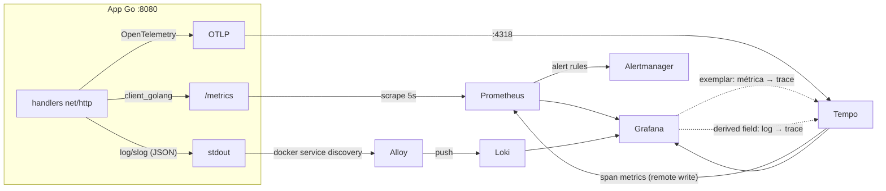

# Go Observability Starter

[](https://github.com/lvcas-dotcom/go-observability-starter/actions/workflows/ci.yml)
[](LICENSE)
[](app/go.mod)

**Stack de observabilidade completa para um serviço Go — métricas, logs e traces, ligados entre si — que sobe populada com um único comando.**

[English](README.md)


---

## Por que mais um

A maioria dos starters de observabilidade te entrega a infra vazia. Você
configura o datasource, monta o dashboard do zero e roda `curl` num loop só pra
ver alguma linha se mexer. Metade deles ainda usa componentes que o upstream já
aposentou.

Este é diferente em três pontos:

**Ele sobe com dados dentro.** O app de exemplo gera o próprio tráfego, com
latência realista, um caminho lento e uma taxa de falha. Todo painel está
populado segundos depois do `docker compose up` — sem `curl` manual, sem
gráfico vazio.

**Os três pilares realmente se conectam.** Um pico de latência no gráfico
carrega um exemplar em que você clica pra abrir exatamente o trace por trás
dele. Esse trace leva às linhas de log que ele produziu. Essas linhas levam de
volta ao trace. Essa correlação é justamente a parte que a maioria dos
tutoriais pula, e é a parte que importa quando algo quebra de verdade.

**Nada aqui está descontinuado.** Alloy no lugar do Promtail, que foi
aposentado. Loki com TSDB e schema v13, não o boltdb-shipper depreciado no v11.
Prometheus 3 com native histograms e exemplar storage ligados. O CI sobe a
stack inteira a cada commit e verifica que cada componente funciona de verdade.

---

## Quick start

```bash
git clone https://github.com/lvcas-dotcom/go-observability-starter.git
cd go-observability-starter
docker compose up --build
```

Depois abra **<http://localhost:3000>** — ele cai direto no dashboard, já
populado. Sem login, sem configurar datasource, sem importar dashboard.

| Serviço | URL | O que é |
|---|---|---|
| **Grafana** | <http://localhost:3000> | Dashboards, abre na visão geral |
| App de exemplo | <http://localhost:8080> | O serviço Go instrumentado |
| Métricas raw | <http://localhost:8080/metrics> | O que o Prometheus coleta |
| Prometheus | <http://localhost:9090> | Métricas, recording rules, alertas |
| Alertmanager | <http://localhost:9093> | Alertas disparados |
| Loki | <http://localhost:3100> | API de logs |
| Tempo | <http://localhost:3200> | API de traces |

Requer Docker com o plugin Compose v2. `make up` faz o mesmo e imprime os links.

---

## O tour de 60 segundos

Essa é a parte que vale realmente fazer — é pra isso que o repositório existe.

**1. Métrica → trace.** No painel *Percentis de latência*, ache um dos pontinhos
na linha do p95. São exemplars. Clique em um e o Grafana abre exatamente o
trace que produziu aquela amostra de latência, span por span. Você vai cair num
span `query-database` que levou 800ms porque o app coloca 10% das requisições
num caminho lento de propósito.

**2. Trace → logs.** Dentro do trace, clique em *Logs for this span*. Você
recebe as linhas de log que aquela requisição emitiu — casadas por trace ID,
não por chute de timestamp.

**3. Log → trace.** Agora o caminho inverso: expanda qualquer linha do painel
*Logs* e clique no link **TraceID**. Direto de volta pro Tempo.

**4. Service graph.** Explore → Tempo → *Service Graph*. O Tempo deriva isso
das span metrics e faz remote write pro Prometheus. Sem instrumentação extra.

**5. Quebre de propósito.**

```bash
docker compose stop app        # AppDown dispara em ~30s
docker compose start app
```

Acompanhe em <http://localhost:9090/alerts> e <http://localhost:9093>.

Tem um segundo dashboard pro runtime do Go — goroutines, heap, pausas de GC e
recursos do processo, tudo de graça pelo `client_golang`:


---

## Como as peças se encaixam



| Componente | Versão | Papel |
|---|---|---|
| [Prometheus](https://prometheus.io) | 3.6 | Métricas, recording rules, alertas, exemplars |
| [Loki](https://grafana.com/oss/loki/) | 3.5 | Logs, TSDB + schema v13, structured metadata |
| [Tempo](https://grafana.com/oss/tempo/) | 2.8 | Traces, span metrics, service graph |
| [Alloy](https://grafana.com/docs/alloy/) | 1.10 | Coleta de logs — substitui o Promtail aposentado |
| [Alertmanager](https://prometheus.io/docs/alerting/latest/alertmanager/) | 0.28 | Roteamento, agrupamento e inibição de alertas |
| [Grafana](https://grafana.com/oss/grafana/) | 12.1 | Dashboards e correlação entre datasources |
| App Go de exemplo | Go 1.26 | `client_golang` + `log/slog` + OpenTelemetry |

---

## Padrões que valem copiar

O app de exemplo é pequeno de propósito, mas cada pedaço dele está ali por um
motivo. Estes são os que valem levar pra um serviço real:

**Logs correlacionados com trace.** Um `slog.Handler` customizado carimba
`trace_id` e `span_id` em todo registro a partir do contexto da requisição
([`logging.go`](app/logging.go)). Esse único detalhe é o que faz todo link
log↔trace do Grafana funcionar.

**Exemplars no histograma.** O middleware de métricas anexa o trace ID ativo a
cada observação ([`middleware.go`](app/middleware.go)), e o `/metrics` é
servido com OpenMetrics habilitado pra que eles cheguem ao Prometheus. Sem a
segunda metade, a primeira é descartada silenciosamente.

**Label de rota, nunca path cru.** O label vem do padrão de rota, não de
`r.URL.Path`. Colocar path cru em label do Prometheus é o jeito mais rápido de
derreter seu TSDB no instante em que aparecer tráfego real com IDs na URL. Tem
um teste que quebra se isso regredir.

**Um wrapper de response que não quebra streaming.** Envolver
`http.ResponseWriter` de forma ingênua mata SSE e WebSocket em silêncio, porque
o wrapper deixa de satisfazer `http.Flusher` e `http.Hijacker`. O
[`middleware.go`](app/middleware.go) implementa `Unwrap` mais
`Flush`/`Hijack`/`ReadFrom` explícitos.

**Recover de panic por dentro da instrumentação, não por fora.** A colocação
óbvia — envolver o mux inteiro num middleware de recover — faz o panic passar
direto pelo código que grava as métricas. Aí o endpoint que mais quebra é o que
*some* do gráfico em vez de dar pico. O [`server.go`](app/server.go) coloca o
recover por dentro e grava num `defer`. Tem teste que quebra se inverterem.

**Liveness separado de readiness.** `/healthz` diz que o processo está vivo;
`/readyz` diz que ele deve receber tráfego. O shutdown derruba readiness
primeiro e só depois drena. Confundir os dois é como começa um restart loop
durante uma indisponibilidade.

**Graceful shutdown que faz flush da telemetria.** Todo o ciclo de vida vive em
`run() error` em vez de `main()`, então o cleanup adiado realmente executa e o
último lote de spans não é perdido — justamente os traces que você mais quer
depois de um crash.

**Timeouts de verdade no servidor HTTP.** O `http.ListenAndServe` deixa todo
timeout em zero, ou seja, sem timeout nenhum, o que é trivialmente vulnerável a
Slowloris. Veja [`server.go`](app/server.go).

**Recording rules como fonte única de verdade.** "Taxa de erro" é definida uma
vez em [`prometheus/rules/`](prometheus/rules/), então um painel e o alerta que
te acorda de madrugada nunca podem discordar sobre o que ela significa.

---

## Usando com o seu próprio app

A stack não se importa que o app observado seja o de exemplo.

1. **Exponha `/metrics`** com
   `promhttp.HandlerFor(reg, promhttp.HandlerOpts{EnableOpenMetrics: true})`.
   OpenMetrics é obrigatório pros exemplars.
2. **Aponte o Prometheus pra ele** — edite o job `go-app` em
   [`prometheus/prometheus.yml`](prometheus/prometheus.yml).
3. **Logs não precisam de mudança** se você já loga JSON no stdout. O Alloy
   descobre todo container pelo socket do Docker. Ajuste os nomes dos campos em
   [`alloy/config.alloy`](alloy/config.alloy) pra extrair `level` e `trace_id`.
4. **Envie traces** pra `tempo:4318` (OTLP/HTTP) ou `tempo:4317` (gRPC). A
   variável padrão `OTEL_EXPORTER_OTLP_ENDPOINT` basta pra maioria dos SDKs.
5. **Ajuste os dashboards** se os nomes das métricas forem outros. Os painéis
   usam a variável `$route`, então trocar o nome do label é um find-and-replace.

Pra rodar a stack com tráfego real em vez do gerador:

```bash
DEMO_TRAFFIC=false docker compose up --build
```

---

## Configuração

Copie [`.env.example`](.env.example) pra `.env` — o Compose lê automaticamente.

| Variável | Padrão | O que faz |
|---|---|---|
| `DEMO_TRAFFIC` | `true` | Gerador de tráfego sintético |
| `LOG_LEVEL` | `info` | `debug`, `info`, `warn`, `error` |
| `TRACE_SAMPLE_RATE` | `1.0` | Fração de requisições com trace |
| `VERSION` | `dev` | Tag da imagem e `app_build_info` |
| `PROMETHEUS_RETENTION` | `24h` | Quanto tempo as métricas ficam em disco |
| `SHUTDOWN_TIMEOUT` | `10s` | Prazo para as requisições em voo |
| `APP_PORT`, `GRAFANA_PORT`, … | ver `.env.example` | Mapeamento de portas |

Valores inválidos quebram o boot com erro claro, em vez de cair silenciosamente
num padrão que ninguém pediu.

---

## Alertas

As regras vivem em
[`prometheus/rules/app-rules.yml`](prometheus/rules/app-rules.yml) — cinco
recording rules e seis alertas:

| Alerta | Dispara quando |
|---|---|
| `AppDown` | O app não é coletado há 30s |
| `HighErrorRate` | Proporção de 5xx acima de 15% por 2min |
| `HighLatencyP95` | p95 acima de 1s por 2min |
| `NoTrafficReceived` | Praticamente nenhuma requisição por 5min — silêncio não é saúde |
| `GoroutineLeakSuspected` | Goroutines acima de 500 por 10min |
| `ObservabilityComponentDown` | Qualquer componente da stack fora por 1min |

O receiver padrão do Alertmanager não vai a lugar nenhum de propósito, pra que
a stack não tenha nenhuma dependência externa pra subir. Os alertas continuam
totalmente visíveis em <http://localhost:9093>. Pra receber notificação de
verdade, descomente o bloco do Slack ou de webhook em
[`alertmanager/alertmanager.yml`](alertmanager/alertmanager.yml) e coloque a URL
no `.env` em vez de commitar.

---

## Estrutura

```
.
├── app/                       # serviço Go instrumentado
│   ├── main.go                #   ciclo de vida, sinais, graceful shutdown
│   ├── server.go              #   rotas, cadeia de middleware, timeouts HTTP
│   ├── middleware.go          #   métricas RED, exemplars, access log, recovery
│   ├── handlers.go            #   endpoints e trabalho simulado
│   ├── metrics.go             #   registry próprio, native histograms
│   ├── tracing.go             #   setup do OTel, exporter OTLP, sampling
│   ├── logging.go             #   handler slog com correlação de trace
│   ├── traffic.go             #   gerador de tráfego sintético
│   ├── config.go              #   config por env com validação
│   └── *_test.go              #   39 testes, sem data race
├── prometheus/
│   ├── prometheus.yml         # scrape config, self-monitoring
│   └── rules/app-rules.yml    # recording rules + alertas
├── alertmanager/
├── loki/                      # TSDB, schema v13, structured metadata
├── tempo/                     # receivers OTLP, gerador de span metrics
├── alloy/config.alloy         # descoberta de logs no Docker e parse de JSON
├── grafana/
│   ├── provisioning/          # datasources com cross-links, dashboards
│   └── dashboards/            # visão geral e runtime do Go
├── scripts/smoke-test.sh      # verificações ponta a ponta, usado pelo CI
└── docker-compose.yml
```

---

## Segurança

**Isto é uma stack de demonstração local. Não exponha.** O Grafana roda com
acesso anônimo de admin, nenhum dos backends exige autenticação, e o Alloy
monta o socket do Docker — o que dá, na prática, root no host, sendo read-only
ou não.

Cada trade-off está documentado no [SECURITY.md](SECURITY.md), junto do que
mudar antes de rodar algo assim numa rede compartilhada.

---

## Desenvolvimento

```bash
make up        # builda e sobe tudo
make test      # go test -race
make lint      # go vet + golangci-lint
make validate  # configs do compose, Prometheus, Alertmanager e Alloy
make smoke     # sobe a stack e valida ponta a ponta
make load      # dispara 200 requisições pra mexer os gráficos
make clean     # para tudo e apaga os dados coletados
```

`make help` lista todos os alvos.

O CI roda a suíte de testes, os linters, todos os validadores de config e um
boot completo da stack com verificações em cada componente. A afirmação de que
isso funciona com um comando é testada, não só escrita.

---

## Contribuindo

Issues e PRs são bem-vindos — veja o [CONTRIBUTING.md](CONTRIBUTING.md). A
única restrição que guia a maior parte do review: tudo aqui precisa continuar
legível numa sentada só.

## Licença

[MIT](LICENSE)
